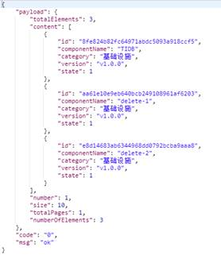

本地安装zookeeper


run:IDE内右键运行StartupApplication类，启动程序。


### 下载时间：


### 完成时间：


### 项目完成整体流程如下：

1， 下载项目，排除项目中的错误（缺少optimus-commons包，Log切面缺少阿里fastjson包）

2， 编写服务提供者方项目(deepexi-user-center)，创建数据库，修改项目配置文件，配置到本地环境。

3， 编写服务提供方项(deepexi-product-center),调整项目的配置。

4， 下载安装zookeeper,以Standalone模式启动zookeeper。

5， 启动项目开始进入项目调试阶段。

6， 通过调试，修改bug并完成项目。

 

项目开发中遇到的问题：

1. 服务消费方的应用出现异常，Dubbo引用对象为空，经过日志排查以及Zookeeper节点数据排查，发现ZK节点上消费方的version丢失。最后定位到服务消费方的引用注解上没有标注版本号问题。

 

 

### 部分RPC数据：

#### 服务消费方日志：

```
   2019-07-02 00:55:53.464    INFO 10940 --- [nio-8080-exec-5] com.deepexi.product.aop.LogAspect        : 日志统一打印   ===== com.deepexi.product.controller.ComponentController.getComponentList()   start =====,参数:   [1,10,null,null,1]   
   2019-07-02 00:55:53.639    INFO 10940 --- [nio-8080-exec-5]   com.deepexi.product.aop.LogAspect          : 日志统一打印 ===== com.deepexi.product.controller.ComponentController.getComponentList()   end =====,响应时间:122毫秒,响应内容:   {"code":"0","msg":"ok","payload":{"totalElements":1,"content":[{"id":"8fe824b82fc64971abdc5093a918ccf5","componentName":"TIDB","category":"基础设施","version":"v1.0.0","state":1}],"number":1,"size":10,"totalPages":1,"numberOfElements":1}}  
```

#### 服务提供方日志： 

```
   2019-07-02 00:55:53.542    INFO 320 --- [20880-thread-25] com.deepexi.user.aop.LogAspect           : 日志统一打印   ===== com.deepexi.user.service.impl.ComponentServiceImpl.getComponentList() start   =====,参数:   [1,10,null,null,1]   
   2019-07-02 00:55:53.547 DEBUG 320 --- [20880-thread-25]   c.d.u.m.C.selectPageVo_COUNT               : ==>  Preparing: SELECT   count(0) FROM component WHERE state = ?    
   2019-07-02 00:55:53.548 DEBUG 320 --- [20880-thread-25] c.d.u.m.C.selectPageVo_COUNT             : ==> Parameters: 1(Byte)   2019-07-02 00:55:53.551 DEBUG 320 --- [20880-thread-25]   c.d.u.m.C.selectPageVo_COUNT               : <==      Total: 1   
   2019-07-02 00:55:53.553 DEBUG 320 --- [20880-thread-25]   c.d.u.m.ComponentMapper.selectPageVo       : ==>  Preparing: SELECT *   FROM component WHERE state = ? LIMIT ?    
   2019-07-02 00:55:53.608 DEBUG 320 --- [20880-thread-25]   c.d.u.m.ComponentMapper.selectPageVo       : ==> Parameters: 1(Byte), 10(Integer)   2019-07-02 00:55:53.611 DEBUG 320 --- [20880-thread-25]   c.d.u.m.ComponentMapper.selectPageVo       : <==      Total: 1   
   2019-07-02 00:55:53.613    INFO 320 --- [20880-thread-25] com.deepexi.user.aop.LogAspect           : 日志统一打印   ===== com.deepexi.user.service.impl.ComponentServiceImpl.getComponentList()   end =====,响应时间:70毫秒,响应内容:   {"content":[{"category":"基础设施","componentName":"TIDB","id":"8fe824b82fc64971abdc5093a918ccf5","state":1,"version":"v1.0.0"}],"number":1,"numberOfElements":1,"size":10,"totalElements":1,"totalPages":1}   
```


#### ZK节点数据：


```
[zk: localhost:2181(CONNECTED) 14] ls   /dubbo/com.deepexi.user.service.ComponentService   [consumers, configurators, routers, providers]   


 # 服务消费方
[zk: localhost:2181(CONNECTED) 15] ls   /dubbo/com.deepexi.user.service.ComponentService/consumers   [consumer%3A%2F%2F192.168.56.1%2Fcom.deepexi.user.service.ComponentService%3Fapplication%3Ddeepexi-product-center-provider%26category%3Dconsumers%26check%3Dfalse%26dubbo%3D2.6.2%26interface%3Dcom.deepexi.user.service.ComponentService%26methods%3DgetComponentById%2CgetComponentList%2CupdateComponentStateById%2CdeleteComponentById%2CcreateComponent%2CbatchDeleteComponentByIds%2CupdateComponentById%26pid%3D10940%26revision%3D1.0.0-SNAPSHOT%26side%3Dconsumer%26timestamp%3D1561996745430%26version%3D1.0.0]  
```

 ```
# 服务提供方 

[zk: localhost:2181(CONNECTED) 0] ls   /dubbo/com.deepexi.user.service.ComponentService/providers   [dubbo%3A%2F%2F192.168.56.1%3A20880%2Fcom.deepexi.user.service.ComponentService%3Fanyhost%3Dtrue%26application%3Ddeepexi-user-center-provider%26default.timeout%3D5000%26dubbo%3D2.6.2%26generic%3Dfalse%26interface%3Dcom.deepexi.user.service.ComponentService%26methods%3DgetComponentById%2CgetComponentList%2CupdateComponentStateById%2CdeleteComponentById%2CcreateComponent%2CbatchDeleteComponentByIds%2CupdateComponentById%26pid%3D320%26revision%3D1.0.0%26side%3Dprovider%26timestamp%3D1561996555025%26version%3D1.0.0]   
 ```


 

 

## 结果截图：

#### 查询列表（带分页搜索功能）

GET请求

请求参数： 

Page :当前页码

Size: 每页元素个数

State: 状态搜索 （等值匹配）

Category: 类型 （等值匹配）

componentName: 组件名称（模糊匹配 like）


 

 

#### 插入数据：

POST请求

请求头：

Content-Type:application/json; charset=UTF-8

 

请求参数： 

```
{
       "componentName":"TIDB",
       "category":"基础设施",
       "version":"v1.0.0",
       "state":1
}

```


 

 

#### 单条信息查看：

 


 

 

#### 修改功能： 


#### 单条查看： 


 

#### 上架/下架：


 

#### 批量删除：

初始数据




删除后数据

